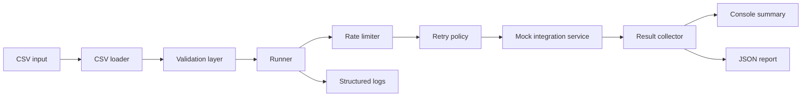

# Architecture

Integration Runner is organized as a small pipeline of focused modules:

```text
CSV input -> validation -> runner -> rate limiter -> retry policy -> mock integration -> reporters
```



## Components

- `src/cli.js` parses runtime options and resolves file paths.
- `src/csvLoader.js` loads CSV rows into job objects.
- `src/validator.js` validates required fields before execution.
- `src/runner.js` coordinates concurrency, rate limiting, retries, logs, and result aggregation.
- `src/mockIntegration.js` simulates external API outcomes.
- `src/reporters/consoleReporter.js` prints a human-readable summary.
- `src/reporters/jsonReporter.js` writes a machine-readable run report.

## Reliability Model

The runner separates permanent validation failures from transient integration failures. Invalid input is rejected before any external call. Transient API errors are retried with exponential backoff, while permanent API errors fail fast.
