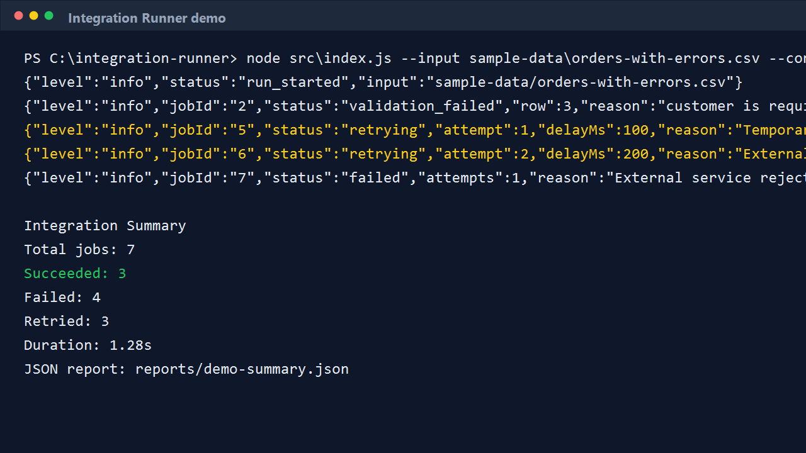

# Demo Output

## Successful Batch

Run:

```bash
node src/index.js --input sample-data/orders.csv --concurrency 3 --retries 3 --rate-limit 5
```

Example summary:

```text
Integration Summary
Total jobs: 5
Succeeded: 5
Failed: 0
Retried: 0
Duration: 0.85s
```

## Failure-Handling Batch

Run:

```bash
node src/index.js --input sample-data/orders-with-errors.csv --concurrency 3 --retries 3 --rate-limit 5 --output reports/demo-summary.json
```

Selected structured logs:

```json
{"level":"info","jobId":"2","status":"validation_failed","row":3,"reason":"customer is required"}
{"level":"info","jobId":"5","status":"retrying","attempt":1,"delayMs":100,"reason":"Temporary API failure","code":"TEMPORARY_FAILURE"}
{"level":"info","jobId":"6","status":"retrying","attempt":2,"delayMs":200,"reason":"External service rate limit","code":"RATE_LIMITED"}
{"level":"info","jobId":"7","status":"failed","attempts":1,"reason":"External service rejected the payload","code":"VALIDATION_ERROR"}
```

Example summary:

```text
Integration Summary
Total jobs: 7
Succeeded: 3
Failed: 4
Retried: 3
Duration: 1.28s
```

The command writes a structured JSON report with per-job results, retry counts, runtime duration, and execution logs.


